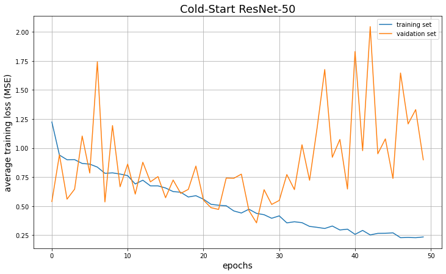

# DeepLearningSystemsProject

The goal of this project is to fit 3D CNNs on optical coherence tomography (OCT) scans of the eyeball to measure the relationship between an organism’s eyeball shape, intraocular pressure ("IOP") and intracranial pressure ("ICP"). Since we only had around 1500 scans to work with, we attempted various training techniques to solve data scarcity problems, including data augmentation and warm-starting from pretrained models. A large portion of this project was spent consolidating, evaluating, and transforming the data into a model-ready state. To save you the hassle of needing to convert the data to a Python-readable state, we stored all the transformed scans [here](https://drive.google.com/drive/folders/1V_glXCRkb0v1KCIRqZevNC-ZhherPsWg?usp=sharing).

The primary intent of this work is to see if we can avoid measuring ICP directly and instead use IOP and eyeball scans as a proxy to gain insight into ICP. ICP procedures are incredibly dangerous, with potential risks including death, so there is large reason to want to avoid ICP procedures in favor of less dangerous alternatives, such as IOP and eye scan procedures. It's believed that fluctuating IOPs can lead to deformations of structures in the eye, namely the lamina. Due to the resolution of these scans, small perturbations in the IOP are believed to cause structural lamina changes, as the pressure exerted on this tissue change. Such changes in pressure should cause its shape to bend. Our belief is a well-trained CNN would detect such structural deformations, and when given an objective (in this case, ICP), would learn how changes in the ICP would impact the lamina. Thus, when presented with scans of a lamina, a trained CNN would be able to accurately predict a patient's ICP, removing the need to perform any invasive brain-pressure measuring procedures. 

## Moving Data

In order to first move the scan data into the right directory, we needed to use the `rclone` command to transfer files from our Google Drive to NYU's HPC. An example of such a command is below: 

`rclone copy dlsysproject:"DeepLearningSystemsProjec/data/torch_standardized" /home/{netID}/DeepLearningSystemsProjec/data/torch_standardized`

## Pretrained Model

The performance of deep learning models is greatly impacted by the quantity of training data, and we only have 1500 scans from 14 monkeys. We could not guarantee that we could sufficiently train any model from scratch, and finding the optimal hyperparameters would be even harder. Taking a pretrained model and finetuning it on our task could greatly increase the likelihood and speed of training convergence as well as improving the final model accuracy. 

We used [Tencent’s MedicalNet](https://github.com/Tencent/MedicalNet) as our candidate model. The MedicalNet is a set of ResNets that were pretrained on MRI scan data of the brain. We believed that 3D MRI scans of the brain would be able to adjust the model parameters that reduce error and such parameter tuning would closely resemble a training job on 3D scans of monkey's eyeballs. Thus, through this "warmstarting" method, it's believed that validation convergence could be achieved faster with potentially accuracy. We ran tests on both a standard, untrained ResNet-50 model and a pretrained ResNet-50 model and compared final validation errors.

## Running train.py

### Training from scratch:

To then train the data, we used the standard HPC `sbatch` command.

`sbatch run.s`

This simply executes `python train.py`, although we can add additional arguments via Python's `argparse`.

### Training from pretrained model:

Be sure to download the pretrained model from this [link](https://drive.google.com/drive/folders/1vkUCMRycYyYP4vg6CakTxsctuaC8DJjm?usp=sharing) and place it in the appropriate directory as seen in the `run_pretain.s` file and the command below.

`sbatch run_pretrain.s`

`python train.py  --pretrain_model src/models/pretrain/resnet_50.pth`

## Challenges

## Results

The results for the cold-start and pretrained model can be seen below:

As we can see in the plots, our validation loss was decreasing until about ~25 epochs. This indicates that there was a degree of generalization in our modeling, meaning that IOP and eyeball scans are able to provide predictive value for ICP measurements. This is a great start, as it indicates that using IOP and eyeball scans can serve as a substitute to invasive ICP procedures.